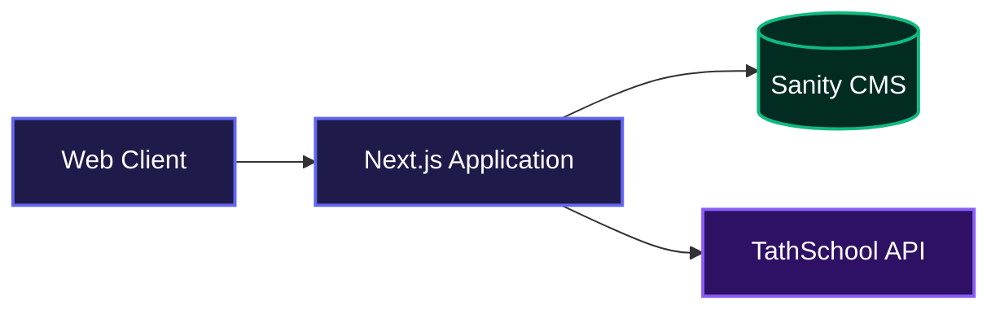
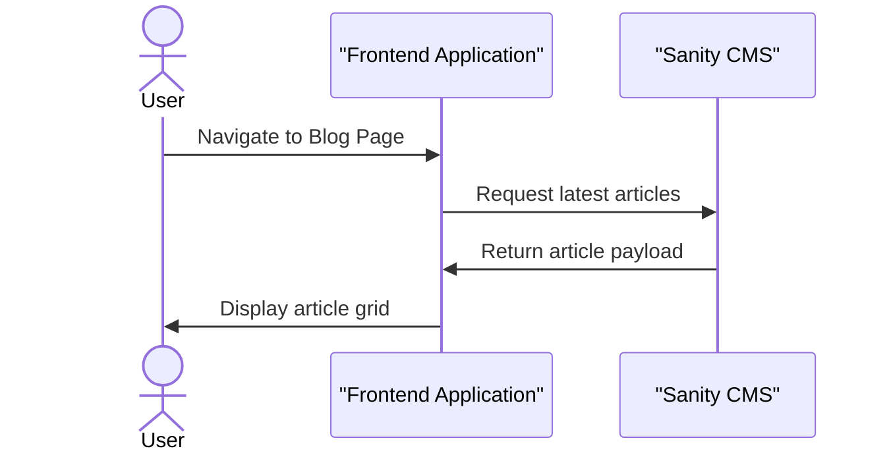
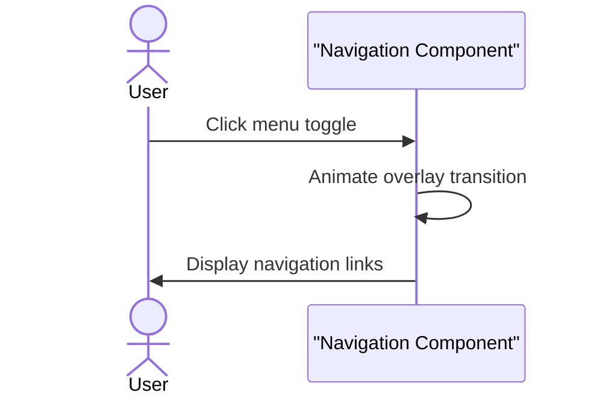

# Ibrahim Malamiromba Personal Site

This project serves as the central hub for a tech educator, bringing together courses, blog posts, and video lessons into one accessible platform. It helps users discover educational content originally scattered across multiple services, providing a unified gateway for booking workshops and exploring learning materials.

## System Architecture



## Getting Started

Follow these instructions to set up the project locally.

### Installation

Clone the Repository:
```bash
git clone https://github.com/Malamiromba-td/malamiromba.git
cd malamiromba
```

Install dependencies:
```bash
npm install
```

Configure your local environment variables by copying the example file:
```bash
cp .env.example .env.local
```

Start the local development server:
```bash
npm run dev
```

## Usage

Once the development server is running, open your web browser and navigate to the application.

```bash
http://localhost:3000
```

Use the sliding navigation menu triggered by the hamburger icon to browse different sections, such as the blog, courses, or contact pages. The application will fetch the latest educational materials from external APIs on demand.

## Features

* **Unified Content Aggregation**: Pulls courses, video lessons, and books from separate educational platforms into a single grid layout for easier discovery.
* **Dynamic Blog Integration**: Automatically retrieves the newest tech and AI literacy articles from an external headless CMS.



* **Interactive Interface**: Features a responsive split-screen layout with an animated full-screen navigation overlay built with highly optimized transitions.



* **Responsive Design**: Automatically scales the presentation of content, stacking grid elements and hero sections smoothly on mobile devices.

## Environment Variables

The application relies on several external services for content. You must configure these variables in your local environment.

```env
# Course Data Endpoint
TATHSCHOOL_API_URL=https://tath.school/api/courses
TATHSCHOOL_API_KEY=your_api_key_here

# Video Data Endpoint
TATHSCHOOL_VIDEOS_API_URL=https://tath.school/api/videos

# Books Data Endpoint
BOOKS_API_URL=https://storefront.api/books
BOOKS_API_KEY=your_api_key_here

# Blog Content Configuration
SANITY_PROJECT_ID=your_sanity_project_id
SANITY_DATASET=production
SANITY_API_VERSION=2023-01-01
SANITY_API_TOKEN=optional_private_token
TECHINHAUSA_BLOG_BASE_URL=https://techinhausa.org/blog
```

## Technologies Used

| Technology | Description |
|------------|-------------|
| Next.js | Framework handling routing and server-side rendering logic. |
| React | Library used to build the responsive user interface. |
| TypeScript | Provides static typing to ensure robust code quality. |
| Tailwind CSS | Utility framework used for responsive layout and styling. |
| Lucide React | Icon library used for interface elements. |

## Contributing

Contributions are welcome to help improve the platform. Please make sure to test your code locally and verify that the user interface remains fully responsive across all screen sizes before submitting a pull request.

## Author Info

* GitHub: [ibbaba](https://github.com/ibbaba)

---

[](https://nextjs.org/)
[](https://reactjs.org/)
[](https://www.typescriptlang.org/)
[](https://tailwindcss.com/)

[](https://dokugen.samueltuoyo.com)